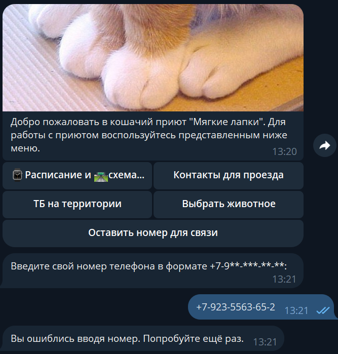

# Телеграм бот FirstTeam PetShelter

К нам обратился приют животных из Астаны, который 
хочет помочь людям, которые задумываются о том, чтобы забрать собаку или кошку домой. Для многих их клиентов это первый опыт, а обращений к ним каждый день поступает так много, что они не успевают их обрабатывать вручную.

Руководство приюта обратилось к нам за помощью: они попросили написать телеграмм-бота, который сможет отвечать на популярные вопросы людей о том, что нужно знать и уметь, чтобы забрать животное из приюта.

Также волонтеры приюта в течение месяца просят новых хозяев присылать ежедневный отчет о том, как животное приспосабливается к новой обстановке. Эту часть работы заказчик тоже попросил передать боту.

В разработке проекта приняли участие следующие разработчики:
- [Смирнов Юрий](https://github.com/jonathan-sm)
- [Гельфер Павел](https://github.com/Pavel1095)
- [Волков Владислав](https://github.com/serper35)
- [Вахитов Артур](https://github.com/veliart)
- [Владислав Алиев](https://github.com/VGAliyev)

При разработке использовались следующие инструменты и технологии (библиотеки):

- IntelliJ IDEA
- Java 17
- [Java Telegram Bot API (версия 7.1.0)](https://github.com/pengrad/java-telegram-bot-api)
- SpringBoot (версия 3.2.3)
- Swagger
- Liquibase
- Postgresql
- Сборка с помощью Maven

## Скриншоты

    
Начало работы с ботом, вывод собачьего приюта и информации о нём

    
Расписание и схема проезда + Контакты для пропуска + ТБ + Выбор питомца

Ввод номера телефона (корректный)

Ввод номера телефона (не корректный)

Список питомцев кошачьего приюта и меню для выбранной кошки

Список питомцев собачьего приюта и меню для выбранной собаки

